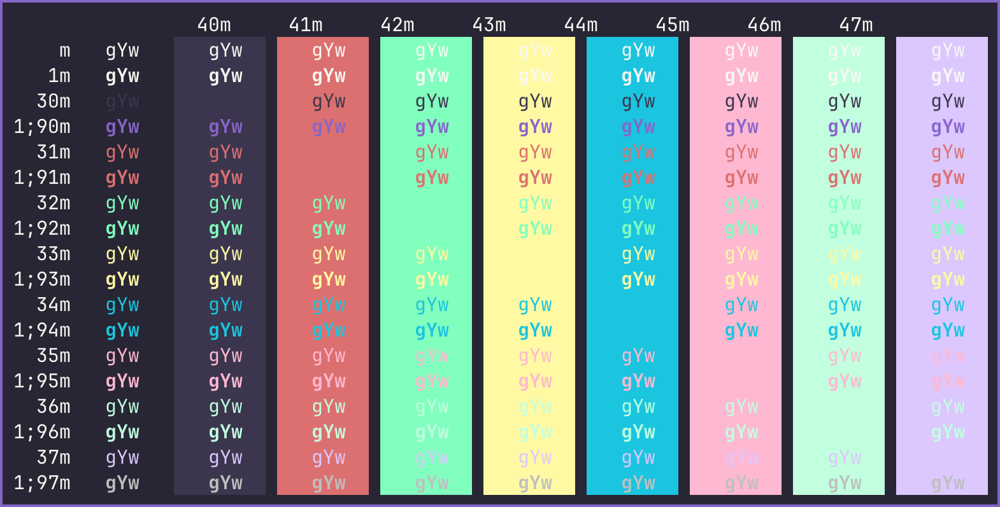

# Witch Hazel (Hypercolor) Ghostty
Witch Hazel Hypercolor for Ghostty.

 

* [Ghostty for macOS and Linux](https://ghostty.org/)

* [Witch Hazel](https://witchhazel.thea.codes/) 

Place file in ~/.config/ghostty/themes/ (create folders if non-existing).

*Witch Hazel Hypercolor*

 

